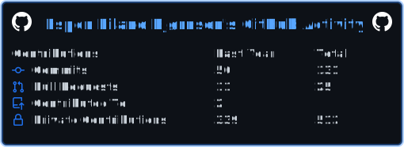
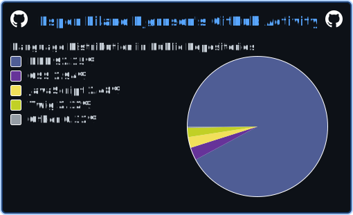

## Hi there 👋 i'm Espen

<!--
**Schpenn/Schpenn** is a ✨ _special_ ✨ repository because its `README.md` (this file) appears on your GitHub profile.

Here are some ideas to get you started: -->

- 🛠 I’m currently working on various CMS-projects
- 🌱 I’m continously learning ...
- 📫 How to reach me: espenbjornsen@hotmail.com (yeah... i'm old)
- 😄 Pronouns: He/Him
- ⚡ Fun fact: I used to live in a Buddhist monastery i Bhutan

## Things i have played around with:

 

 

 

